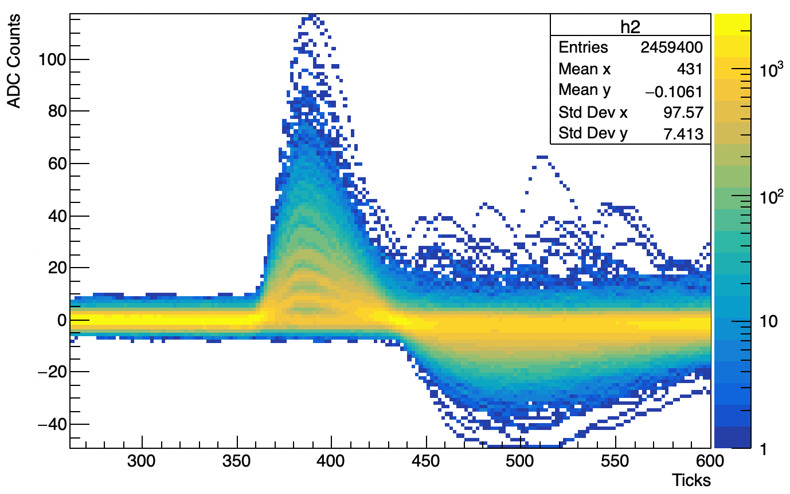

# dune-pd-ana

A C++ analysis framework to estimate the performance of the [DUNE](https://www.dunescience.org) Photon Detection System

## In this repo
Here you can find macros (file.cpp in [this folder](Class/_c)) useful to plot the
persistance of a set of waveforms, compute the Signal-to-Noise ratio from
a calibration run, compute the FFTs of the electronic noise... In
[Macro_description.txt](Macro_description.txt) you can find a brief overview of what the macros do.
"Header" contains the .hpp files where all the functions are delcared,
divided in categories. The const.hpp file is the only one you should change to
adapt the codes to your dataset: it contains all the parameters needed for
your analysis.

The codes are desigend to run interactively in a ROOT session. To open the ROOT
session you should run the following commands:
```bash
root
#include "const.hpp"
#include "/PathToThisRepo/pds-ana/Class/classe.hpp"
auto a = cla()
```
Where const.hpp must be in the folder where you launch the ROOT session. At
this point, you can start play with `a`.
Personally, I have a zsh alias to copy a template const.hpp in the current
folder and to launch the session. (see [scripts](scripts))

## Get started
Whatever you want to do, the first step is to read the data. Be sure that your
data are in a supported format, or write a function that store it in an
std::vector<std::vector<double>>. The `data_format` member allows yu to specify
the function want to use with a simple tag.
```bash
a.data_format = "tag"
a.wf_file = "path/the_file_to_read"
a.memorydepth = #NumberOfTicksPerWf
a.prepulse_ticks = #NumberOfTicksToEvaluateTheBaseline
a.Persistence()
```

Check if everything is correct!

You should see something like:

Keep going with the Enter command.

Hey, your pulse is negative! Let's invert it with:

```bash
a.invert = true/false
```

Now you should see something like:


If you are happy with this starting point, let's update the initial parameters
of the class by:
```bash
a.update()
```
This modifies the const.hpp file, so that the next time you lanch a session you
will resume from the last checkpoint.


Now you 


### Author
Federico Galizzi - f.galizzi1@campus.unimib.it
